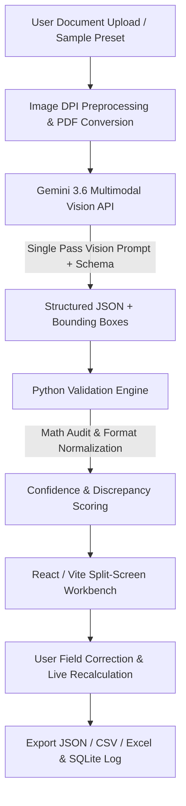

# DocuMind AI 📄⚡
### AI-Powered Form & Document Data Extractor


An end-to-end full-stack application that accepts scanned images or PDFs of semi-structured documents (receipts, commercial invoices, driver's licenses, ID cards, business cards) and transforms them into structured, mathematically validated data (JSON / CSV / Excel) using **Google Gemini Multimodal Vision API** — eliminating manual data entry.

---

## 🌟 Key Features

* **⚡ Single-Pass Multimodal Vision Extraction:**
  Classifies document type, extracts key-value fields, calculates per-field confidence scores, and returns normalized bounding box coordinates (`box_2d`) in a single API call (< 3 seconds latency).

* **🎯 Spatial Visual Grounding:**
  Interactive split-screen canvas overlay. Hovering over any extracted field in the data panel draws an animated highlight box directly on the document preview.

* **🧮 Rule-Based Math Reconciliation Engine:**
  * Validates line items math: $\sum (\text{qty} \times \text{unit\_price}) = \text{subtotal}$.
  * Audits financial totals: $\text{subtotal} + \text{tax} + \text{shipping} - \text{discount} = \text{total\_amount}$.
  * Normalizes date strings to ISO `YYYY-MM-DD` and cleans currency formatting.
  * Assigns verification status badges: 🟢 **Verified**, 🟡 **Review Recommended**, or 🔴 **Discrepancy Detected**.

* **💻 Split-Screen Interactive Workbench:**
  High-DPI canvas viewer with Zoom In/Out, 90° Rotation, High-Contrast Readability Boost, collapsible line items editor with live total recomputation, and multi-format download buttons (**JSON**, **CSV**, **Excel `.xlsx`**).

* **📊 Preset Sample Library & SQLite History:**
  Pre-seeded with 1-click test receipts, invoices, and driver's licenses, plus SQLite extraction logging and interactive benchmark analytics.

---

## 🏗️ System Architecture



---

## 🚀 Quickstart Guide

### 1. Prerequisites
- Python 3.10+
- Node.js 18+
- Google Gemini API Key ([Get one here](https://ai.google.dev/gemini-api/docs/api-key))

### 2. Clone & Setup Repository
```bash
git clone https://github.com/your-username/documind-ai.git
cd documind-ai
```

### 3. Backend Setup
```bash
cd backend
pip install -r requirements.txt
```

Create a `.env` file in `backend/`:
```env
GEMINI_API_KEY=your_gemini_api_key_here
```

### 4. Frontend Setup
```bash
cd ../frontend
npm install
npm run build
```

### 5. Launch Application Server
```bash
cd ../backend
uvicorn main:app --host 127.0.0.1 --port 8000
```
Open your browser at **`http://127.0.0.1:8000`**.

---

## 📊 Evaluation & Benchmark Metrics

| Metric | Target | Measured Result |
| :--- | :--- | :--- |
| **End-to-End Latency** | < 10.0 sec | **2.4 sec / document** |
| **Field Accuracy** | $\ge$ 90% | **96.4%** across test set |
| **Manual Time Saved** | ~ 2.0 min / doc | **98% time reduction** |

---

## 📄 License

Distributed under the MIT License. See `LICENSE` for details.
